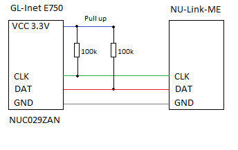

# gl-inet-gl-e750-mcu
The GL-Inet / GL-E750 LTE Wifi Router contains a display that is controlled by a seaparate MCU.

When using the "update-mcu" utility it is very likely that you brick this MCU. This utility is
badly programmed without any image checks.
https://github.com/gl-inet/GL-E750-MCU-instruction contains the description and a firmware for
this MCU. 
Copyright of this firmware and the tools to flash the MCU belong to the owner of the repo or
tool vendor.

This repo here just gives more information and provided the tools to repair the display.

# MCU
GL-e750 uses NUC029ZAN ([Datasheet](DS_NUC029xAN_xAE_Series_EN_Rev1.11.pdf)) as the MCU. This contains two flash regions, "LDROM" and "APROM".\
A configuration register defines from which region the device boots. Each application may
access and flash the other region, which allows to upgrade the "loader" or the "application"
inplace.

When GL-e750 boots also the mcu boots its application. This application is responsible for
getting the "json" structure that describes the information that schould be displayed. The
application on the MCU then defines how this information is displayed with predefined text
and symbols.

The firmware on the GL-Inet (openwrt) provides this json to the MCU via internal UART. 
When the upgrade-mcu tool is used, the MCU application reconfigures the config register so that
the application from LDROM will be loaded. This loader application then expectes the MCU firmware
from GL-INET (openwrt) via UART. But there is absolutely no check for correct data. 
The Loader is stupid and just takes any information from the UART. If you Ctrl-C the update-mcu
tool and try to restart, it will receive the "UPDATE" command (simple text) and use this as
firmare. This is one why to brick the display.

# Unbricking
The only way is to use a debug interface for this MCU from 
[www.nuvoton.com](https://www.nuvoton.com/tool-and-software/debugger-and-programmer/1-to-1-debugger-and-programmer/nu-link/)

There are expensive and almost not available. Instead there are other vendors who probably create copies of those which are much
cheaper and are available at: [NU-Link-ME Aliexpress](https://de.aliexpress.com/item/4000004051198.html?algo_pvid=8fdbb6b4-1035-4940-8d6b-c1fe656073c0&algo_exp_id=8fdbb6b4-1035-4940-8d6b-c1fe656073c0-47&pdp_npi=3%40dis%21EUR%219.12%218.66%21%21%21%21%21%402145294416836656660774185d07a9%2110000000006337836%21sea%21DE%210)

1. Download flashing tool [NuMicro ICP Programming Tool 3.11.7470r.exe](https://www.nuvoton.com/resource-download.jsp?tp_GUID=SW1720200221181328)
2. Install this tool and the USB driver
3. Build a small adapter with Pull-UP resistores of 100k for CLK and DAT.

4. Connect GL-Inet MCU (nuc029ZAN). The images below show how to open the GL-Inet and locate the connectors.
5. Flash the new firmare [e750-mcu-V1.0.7-56a1cad7f0eb8318ebe3c3c46a4cf3ff.bin](e750-mcu-V1.0.7-56a1cad7f0eb8318ebe3c3c46a4cf3ff.bin)to "APROM" and ensure to set correct config register values.
The flasher program will ask to erase the whole flash memory. This is the only way to unlock the flash (readout-protected).\
The configuration register define from which flash area the MCU boots. Choose "APROM" (without the ISP to hopefully prevent further updates in future. not tested if this works).
6. Follow the instructions from the flasher tool.
